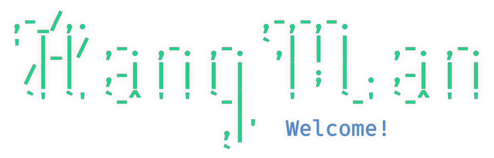

This hangman game is compeletely programmed in Python, relying only one external extension, simple-chalk.


# Running the release
* On **Windows**, download `hangman.exe` from releases/tags and run it.
* On **Mac** & **Linux** download from releases/tags file named `hangman` and run it in terminal with command:
```
chmod +x ./hangman && ./hangman
```

# Running from source code

Download repository, unarchive it and run the app in the unarchived directory wit the following command:

```
python3 src/main.py
```

# Building

To create build manually, you can simply download the repository and run:
```
pyinstaller src/main.py --onefile
```


# Author

Juuso Korhonen


# Credits

The project is entirely made using Python as programming lanuage.

Hangman art by [@ChristianAuman](https://replit.com/@ChristianAuman/Hangman)

External (non-standard) Python libraries used:
* [simple-chalk](https://pypi.org/project/simple-chalk/)