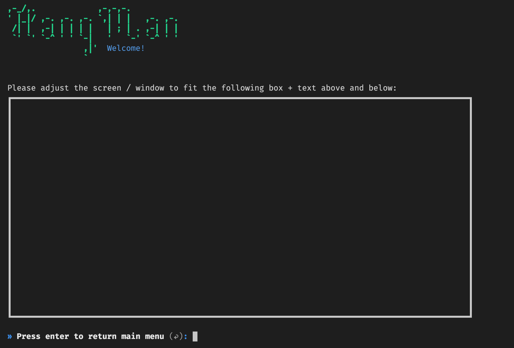
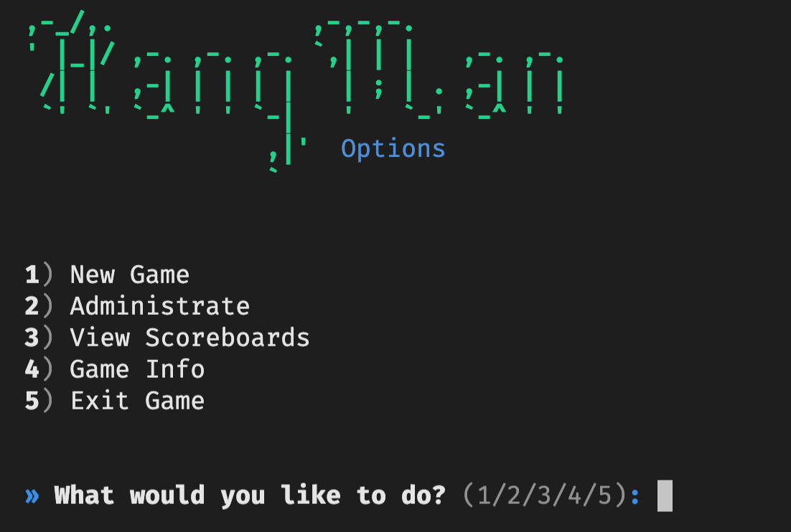
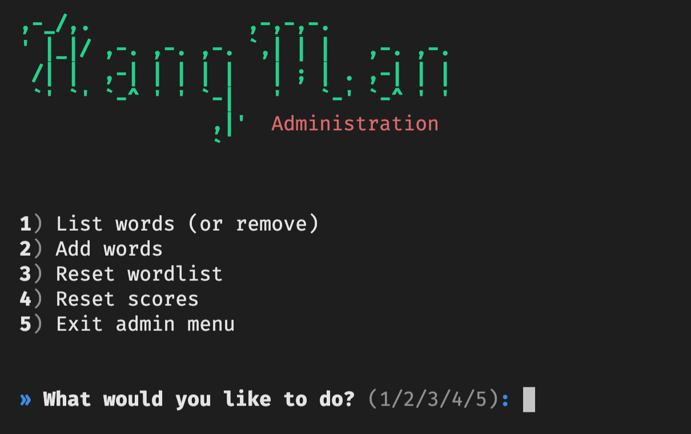
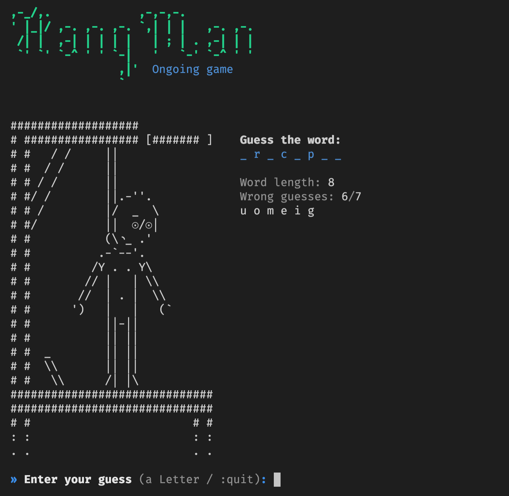

This hangman game is compeletely programmed in Python, relying only one external extension, simple-chalk.

# Screenshots

<br>
<br>
<br>

# Running from the source code

Download repository, unarchive it and run the app in the unarchived directory wit the following command:

```
python3 src/main.py
```

**NOTE:** After launching the game, please resize the window to show the full view of game logo and contents to ensure best gaming experience.

# Author

Juuso Korhonen


# Credits

The project is entirely made using Python as programming lanuage.

Hangman art by [@ChristianAuman](https://replit.com/@ChristianAuman/Hangman)

External (non-standard) Python libraries used:
* [simple-chalk](https://pypi.org/project/simple-chalk/)